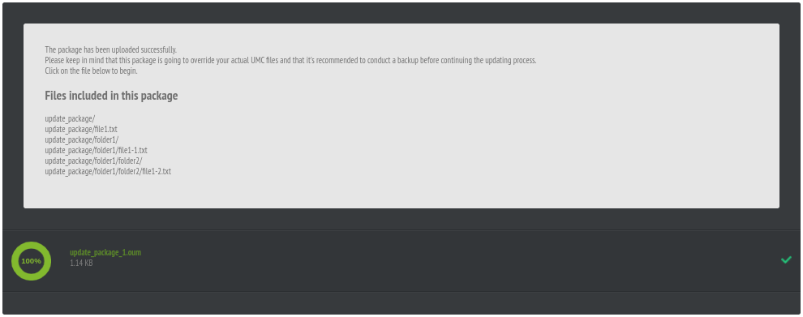

# Update Manager Client

## Introduction

This library is the client side of the Update Manager project from Artica PFMS.

Allows update files in *on-premise* PHP projects and apply database upgrades on them.


## How to use

Update manager client allows package updates in OUM format.

This OUM packages are *zip* files.

To generate an update pack you should zip all files in the way you want them to be in your installation:

```bash
$ tree update_package
update_package/
├── file1.txt
└── folder1
    ├── file1-1.txt
    └── folder2
        └── file1-2.txt

2 directories, 3 files

$ cd update_package && zip -r update_package_1.oum ./
  adding: file1.txt (stored 0%)
  adding: folder1/ (stored 0%)
  adding: folder1/file1-1.txt (stored 0%)
  adding: folder1/folder2/ (stored 0%)
  adding: folder1/folder2/file1-2.txt (stored 0%)

```


Create a file to handle updates with following content


```php
<?php
/**
 * Sample file to perform offline updates.
 */

require_once 'vendor/autoload.php';
use UpdateManager\UI\Manager;

$umc = new Manager(
   // Whatever is placed in url after host name.
   public_url: '/',
   settings: [
       'homedir'             => __DIR__,
       'allowOfflinePatches' => true,
   ],
   mode: Manager::MODE_OFFLINE,
   composer: true
);
$umc->run();


```

By accessing the file via URL, you can use the offline updater:



Press the green area to start the update.

You will receive a summary of the installation process.

If success, then files and folders will be recreated under *homedir* path.


### Links

More information:

https://pandorafms.com/manual/en/documentation/02_installation/02_anexo_upgrade?s[]=update&s[]=manager#automatic_update_with_update_manager


https://pandorafms.com/en/


